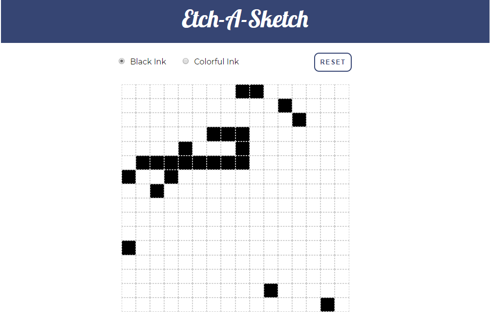
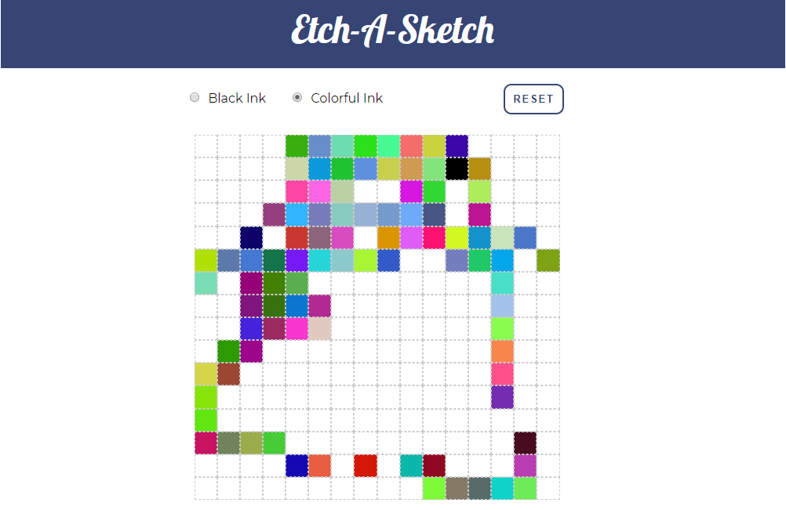
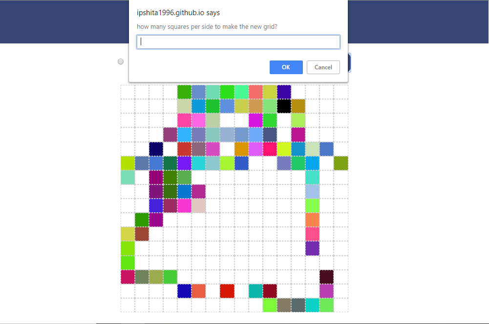
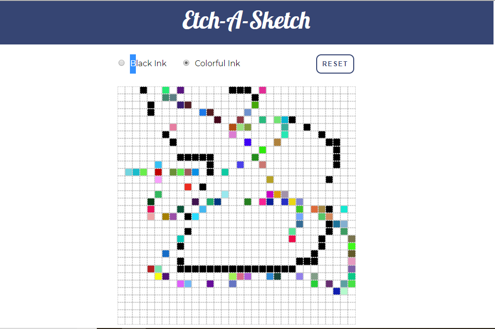

# Etch-A-Sketch
One of the first few JavaScript projects I will be taking on.
This project is an emulation of the drawing boards we used to have back in the old days. We could draw and then erase on a grid like canvas. You can find more details about such a board [here](https://en.wikipedia.org/wiki/Etch_A_Sketch).

## Motivation
I started out with the very informative courses at [The Odin Project](https://www.theodinproject.com/courses/web-development-101) and have begun with **Web Development 101**. This part was one of the many sub-projects I shall be taking on in the **Javascript Basics** portion. The entire exercise is proving to be a very good learning experience.

## Screenshots





## Tech/Framewroks Used
Nothing fancy just same old HTML5, CSS3 and Javascript

## Features
* Clean minimal design.
* A maximum of 34x34 grid system for accomodation in the screen.
* Monochrome and simple.
* Executes the requirements of the board perfectly.
* Black and Colorful Ink available

## Code Example
Below is one of the main functions in Javascript used to create the grid:

```
function creategrid(x){
        console.log('creating');
        for(var j=0;j<x;j++){
            console.log(x);
            const row=document.createElement('div');
            row.classList.add('rows');
            for(var i=0;i<x;i++){
                const cell=document.createElement('div');
                cell.classList.add('in-grid');
                var size=450/x;
                cell.style.width=size+'px';
                cell.style.height=size+'px';
                row.appendChild(cell);
                cell.addEventListener('mouseover',function(e){
                    if(bw.checked){
                        e.target.style.background='black';
                    }
                    else{
                        e.target.style.background=getRandomColor();
                    }
                    
                });
            }
            grid.appendChild(row);
        }
    };

```
## How to Use?
Find the board [here](https://ipshitachatterjee.github.io/Etch-a-Sketch/)

## Credits
**©Ipshita Chatterjee | 2018**

Made for the project that can be found [here](https://www.theodinproject.com/courses/web-development-101/lessons/etch-a-sketch-project)

